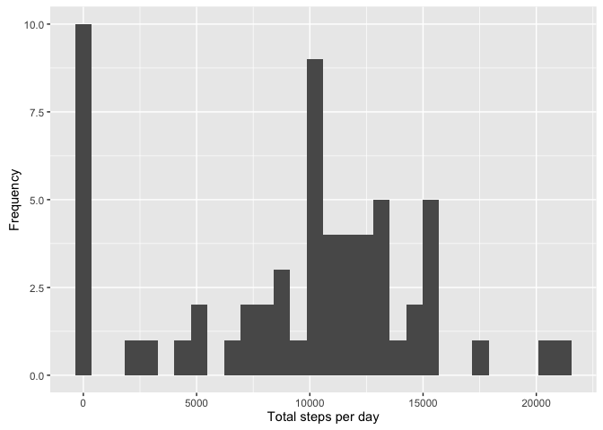

# Reproducible Research: Peer Assessment 1
##Load Required Libraries

```r
library(ggplot2)
```

```
## Warning: package 'ggplot2' was built under R version 3.2.4
```

```r
library(lubridate)
```

```
## Warning: package 'lubridate' was built under R version 3.2.4
```

```
## 
## Attaching package: 'lubridate'
## 
## The following object is masked from 'package:base':
## 
##     date
```

## Loading and preprocessing the data

```r
unzip(zipfile="activity.zip")
dat1 <- read.csv("activity.csv")

#Convert the dates to days since start
days <- (yday(dat1$date) - 1)
dat1$day<-days-(min(days)-1)
```


##1 What is mean total number of steps taken per day?
###1.1 Calculate the total number of steps taken per day

```r
#Now calc sum steps per day
SumPerDay<- aggregate(x=list(SumSteps=dat1$steps), by=list(day=dat1$day), FUN=sum, na.rm=TRUE)
head(SumPerDay)
```

```
##   day SumSteps
## 1   1        0
## 2   2      126
## 3   3    11352
## 4   4    12116
## 5   5    13294
## 6   6    15420
```
###1.2 Make a histogram of the total number of steps taken each day


```r
#Histogram Steps per Day
qplot(SumPerDay$SumSteps, xlab='Total steps per day', ylab='Frequency')
```

```
## `stat_bin()` using `bins = 30`. Pick better value with `binwidth`.
```

 
###1.3 Calculate and report the mean and median of the total number of steps taken per day

```r
mean(SumPerDay$SumSteps)
```

```
## [1] 9354.23
```

```r
median(SumPerDay$SumSteps)
```

```
## [1] 10395
```


##2. What is the average daily activity pattern?

```r
MeanPerInt<- aggregate(x=list(MeanSteps=dat1$steps), by=list(Interval=dat1$interval), FUN=mean, na.rm=TRUE)
head(MeanPerInt)
```

```
##   Interval MeanSteps
## 1        0 1.7169811
## 2        5 0.3396226
## 3       10 0.1320755
## 4       15 0.1509434
## 5       20 0.0754717
## 6       25 2.0943396
```
## 3.Make a time series plot
#### 3.1 Make a time series plot

```r
ggplot(data=MeanPerInt, aes(x=Interval, y=MeanSteps)) +
    geom_line() +
    xlab("5-minute interval") +
    ylab("average number of steps taken") 
```

 

#### 3.2 Which 5-minute interval, on average across all the days in the dataset, contains the maximum number of steps?

```r
MostSteps <-MeanPerInt$Interval[ which.max(MeanPerInt$MeanSteps)]
MostSteps
```

```
## [1] 835
```

## 4. Imputing missing values
### 4.1 Calculate and report the total number of missing values in the dataset

```r
missing <- is.na(dat1$steps)
# table of Missing
table(missing)
```

```
## missing
## FALSE  TRUE 
## 15264  2304
```

```r
#Percent Missing
round((table(missing)[2]/length(dat1$steps))*100,0)
```

```
## TRUE 
##   13
```
###4.2 Create a new dataset that is equal to the original dataset but with the missing data filled in

```r
md<-median(dat1$steps,na.rm=TRUE)
mn<-mean(dat1$steps,na.rm=TRUE)
dat2<-dat1
```
Use the mean to fill in the missing data (simplest option)


```r
dat2$steps[is.na(dat2$steps)]<-mn
mean(dat2$steps)
```

```
## [1] 37.3826
```

###4.3 Make a histogram of the total number of steps taken each day

```r
#Now calc sum steps per day
SumPerDay2<- aggregate(x=list(SumSteps=dat2$steps), by=list(day=dat2$day), FUN=sum, na.rm=F)
head(SumPerDay2)
```

```
##   day SumSteps
## 1   1 10766.19
## 2   2   126.00
## 3   3 11352.00
## 4   4 12116.00
## 5   5 13294.00
## 6   6 15420.00
```

```r
#Histogram Steps per Day
qplot(SumPerDay2$SumSteps, xlab='Total steps per day', ylab='Frequency')
```

```
## `stat_bin()` using `bins = 30`. Pick better value with `binwidth`.
```

 


###4.4 Calculate and report the mean and median total number of steps taken per day

```r
mean(SumPerDay2$SumSteps)
```

```
## [1] 10766.19
```

```r
median(SumPerDay2$SumSteps)
```

```
## [1] 10766.19
```
###4.5 Do these values differ from the estimates from the first part of the assignment?

yes more values have been included

###4.6 What is the impact of imputing missing data on the estimates of the total daily number of steps?

They are higher

##5. Are there differences in activity patterns between weekdays and weekends?

First we create an additional variable showing which intervals are weekend and which weekday

```r
dat2$WkPart <-  ifelse(as.POSIXlt(dat2$date)$wday %in% c(0,6), 'weekend', 'weekday')
```
Create the mean activity per day and plot weekends against weekday

```r
MeanActivityDat2 <- aggregate(steps ~ interval + WkPart, data=dat2, mean)

ggplot(MeanActivityDat2, aes(interval, steps)) + 
    geom_line() + 
    facet_grid(WkPart ~ .) +
    xlab("5-minute interval") + 
    ylab("avarage number of steps")
```

 
There are differences, the highest peak of activity at 500 to 1000 is lower at weekend, but the activity from there on is higher.
